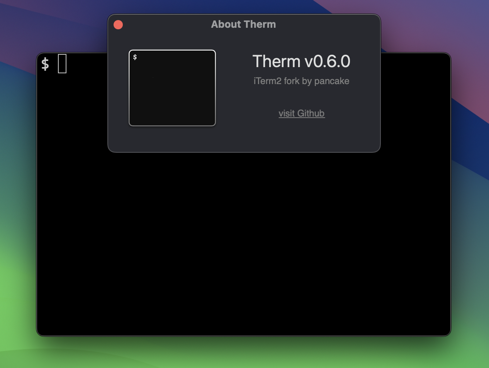

Therm
=====

Therm is a fork of iTerm2 done by pancake <pancake@nopcode.org> that aims to:

* Better defaults for power-users (distraction-less tabs, dark theme, follow mouse, ...)
* Remove clutchy stuff like maximized indicators, scrollbars or title tabs
* No timestamps (removed buggy feature and get some speed)
* No Lion-style fullscreen, standard one is faster and handier
* Fixes application switch issue when follow mouse is enabled
* Non-fullscreen windows have a thin border
* Tabs are small, dark and non-intrussive
* Remove the AutoUpdates (Sparkle framework)
* Search entry is now dark and toggleable with CMD+f
* Removed the integrated SSH client functionality (buggy)
* Avoid blurry and transparency effects (leaky and slow)
* Added more fonts as default (Agave, Profont, Firacode, ...)
* Support CMD+F to toggle foreground (always-on-top)
* Disabled proprietary escape codes, as well as others with bugs (set-title, ..)
* Disable force-touch actions that preview URLs (better use a real browser)

Installation
------------

I have decided to remove the auto-self-update feature, mainly because the library weights too much and i don't like my software to be doing network requests and downloading code that is installed without my own consent or review. I checked the code and the library is a 3rd party project used by many other projects, which is checking the SSL certficate and such, so there's no security issue (afaik).

So, in order to get Therm installed in your system you can:

* Download the last DMG from the Releases github page

	https://github.com/trufae/Therm/releases	

* Install it via brew

	brew install caskroom/cask/therm

Future
------

I will continue removing features and options in order to get a small,
fast and nice terminal, so I don't have to change over 9000 settings
to get it working as I expect on first run.

It is also planned to port Therm to old OSX macs (PowerPC and x86-32).

This is the app where I spent more time in my daily workflow, so it make
sense to not over-engineer or make it fully configurable with features
that <10% of users use.

Settings
--------

To remove your settings and start over, kill Therm, open system Terminal
and type the following command:

	$ rm ~/Library/Preferences/com.pancake.therm.plist

Contributions
-------------

I plan to contribute with iTerm2 by sending bugfixes and feature enhancements
as pullrequests to the original repo, iTerm2 is a great project, and there's
no aim in harming it.

Click here For more information about <a href="https://iterm2.com">iTerm2</a>.

This is an opensource project, under the GPL license, you can contribute by
sending patches or filling issues to share your wishes or concerns.

--pancake
