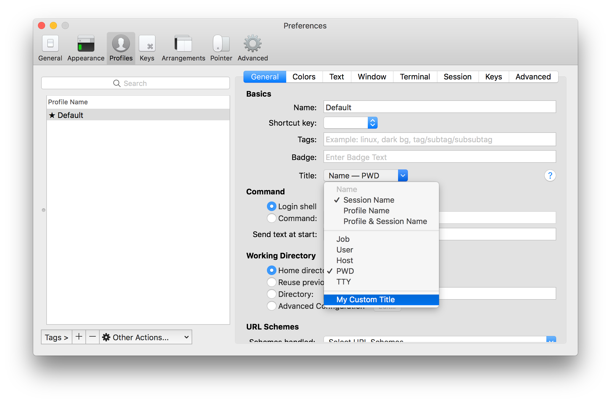

Hooks
=====

iTerm2 provides a mechanism called *hooks* that allows your Python code to modify the app's default behavior.

The following hooks are defined:

* Session title provider
* Status bar provider

Begin by reading about RPCs as described in :doc:`rpcs`. Hooks are similar, but each uses a different decorator.

Session Title Provider
----------------------

A session title provider is an RPC that accepts information about the current session as input and returns a string to be shown in the tab bar or window title.

Here's a minimal example that takes the "auto name" of the session and converts it to upper case. The auto name is the "normal" session name. It defaults to the profile name and can be changed by the control sequence that sets the title, by a trigger that sets the title, or by the user editing the session name in the *Edit Session* window. In other words, this simply causes the title to be the upper-case version of the session name.

.. code-block:: python

    @iterm2.TitleProviderRPC
    async def upper_case_title(auto_name=iterm2.Reference("autoName?")):
        if not auto_name:
            return ""
        return auto_name.upper()

    # Remember to call async_register!
    await upper_case_title.async_register(connection, "Upper-case Title", "com.iterm2.example.upper-case-title")

The `async_register` call takes a second argument which is the display name of the title provider and a third argument that gives the title provider a unique ID. When this script is running and the user navigates to **Prefs > Profiles > General** and opens the **Title** menu, your title provider will appear there with this name.

When does the RPC get run? It is always run once when it gets attached to a session. Thereafter, it is run when any variable with an `iterm2.Reference` as a default value of an argument of your RPC changes.

If some variable might not be defined, you should put a `?` after its name to signify that a
null value is allowed. The function will be called with `None` for such
undefined variables. Variables are detailed in
`Badges <https://www.iterm2.com/documentation-badges.html>`_.

Force Reevaluation
------------------

If you want to change the title in response to some external action, such as a timer, network request, or user action, you must cause a user-defined variable to change. Here is a full working example that sets the session title to its age in seconds:

import asyncio
import iterm2
import traceback

.. code-block:: python

    import asyncio
    import iterm2

    async def main(connection):
        app = await iterm2.async_get_app(connection)
        tasks = {}

        async def redraw_title_provider_periodically(session_id):
           try:
                age = 0
                session = app.get_session_by_id(session_id)
                while True:
                    await asyncio.sleep(1)
                    # When the session ends, this will raise an exception.
                    await session.async_set_variable("user.session_age_in_seconds", age)
                    age += 1
           except Exception as e:
               traceback.print_exc()
           finally:
                del tasks[session_id]

        @iterm2.TitleProviderRPC
        async def age_in_seconds_title(
                session_id=iterm2.Reference("id"),
                age=iterm2.Reference("user.session_age_in_seconds?")):
            if session_id not in tasks:
                wake_coro = redraw_title_provider_periodically(session_id)
                tasks[session_id] = asyncio.create_task(wake_coro)
            return str(age)

        await age_in_seconds_title.async_register(connection, "Age in Seconds", "com.iterm2.example.age-in-seconds")

    iterm2.run_forever(main)

Installation
------------

As this script is a long-running daemon, you'll want to put it in
`~/Library/Application Support/iTerm2/Scripts/AutoLaunch` folder.

Next, you need to configure your session's profile to use the hook. Once it's been registered properly it will appear as an option in **Preferences > Profiles > General > Title**. Select it there:

Troubleshooting
---------------

If anything goes wrong, remember to check the Script Console (**Scripts >
Manager > Console**). Pick your script on the left to view its output. Some
errors are also logged to the *iTerm2 App* history in the script console if
they cannot be tied to a running script.

Use print statements to write to the console. This is an essential technique
for debugging script issues.

If a session title provider is not registered, the title will show an ellipsis: `…`.

If a status bar provider is not registered or has some other problem (such as
an exception), it will show a ladybug: `🐞`. You can click on the ladybug to
get more details about the error.

Always catch exceptions in an async task. One of Python's rough edges is that
these exceptions are silently swallowed and you will pull all your hair out
trying to understand what is wrong.

Take care to mark references optional by suffixing them with a `?` when they
might not exist, as is the case for `user.update_my_title_provider?` the
example above.

----

--------------
Other Sections
--------------

* :doc:`/index`
    * :doc:`index`
    * :doc:`example`
    * :doc:`running`
    * :doc:`daemons`
    * :doc:`rpcs`
    * Hooks

Indices and tables
==================

* :ref:`genindex`
* :ref:`search`
