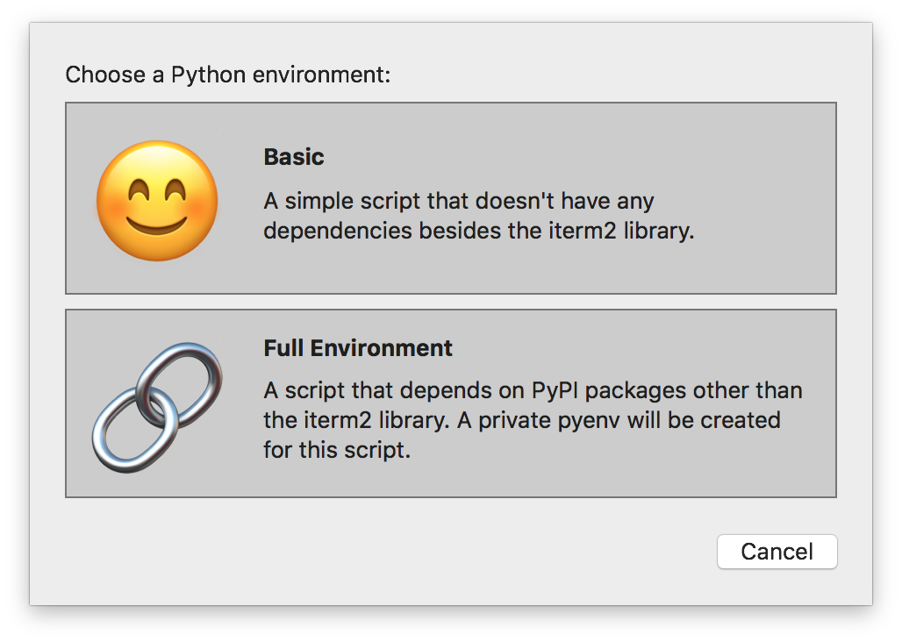
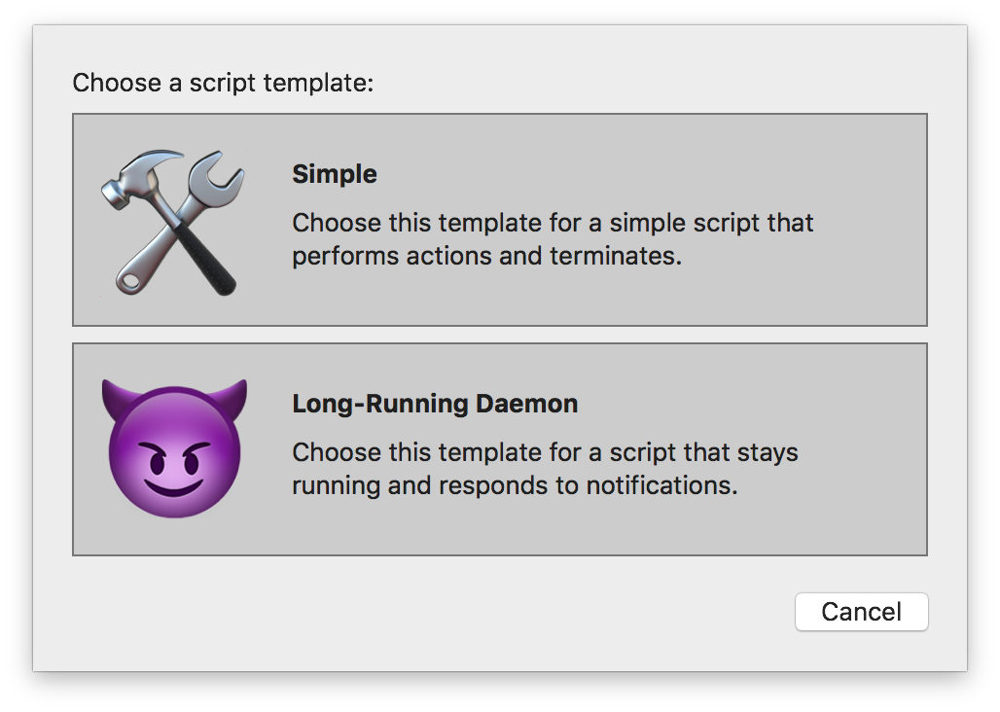

.. _tutorial-index:
.. Python API Introduction

Python API Introduction
=======================

The iTerm2 Python API is a replacement for the AppleScript API that preceded
it. It offers a more powerful set of APIs that give the script writer a great
deal of control.

Scripts generally take one of two forms:

* "Simple" scripts that perform a series of actions, such as creating windows, and then terminate.
* "Long-running daemons" that stay running indefinitely while observing notifications or performing some action periodically.

Creating a New Script
---------------------

iTerm2 provides a convenient user interface for creating a new script. Select
*Scripts > New Python Script*. You'll then be prompted to decide if you want a
"basic" script or one with a "full environment":

Don't worry about the
difference yet. Pick *Basic*, since the code in this tutorial does not depend on
any Python modules besides the built-in ones.

Next, you'll be asked if you want to write a simple script or a long-running
daemon:

Select *Simple*, since the tutorial's example script will just create a window
and then exit.

Next, a save panel opens. Give your script a name, and it will be opened in
your editor.

The script will be filled with a working example.

Continue to the next section, :doc:`example`.

----

--------------
Other Sections
--------------

* :doc:`/index`
    * Python API Introduction
    * :doc:`example`
    * :doc:`running`
    * :doc:`daemons`
    * :doc:`rpcs`
    * :doc:`hooks`

Indices and tables
==================

* :ref:`genindex`
* :ref:`search`
