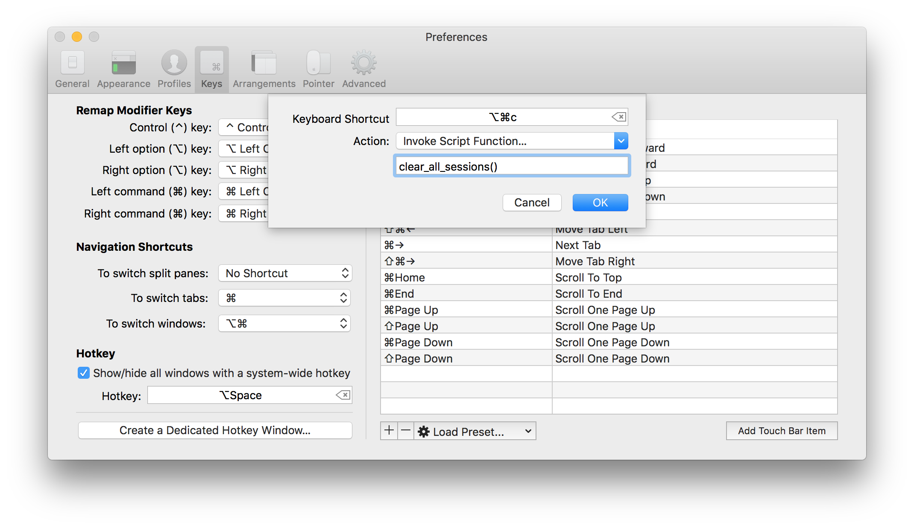
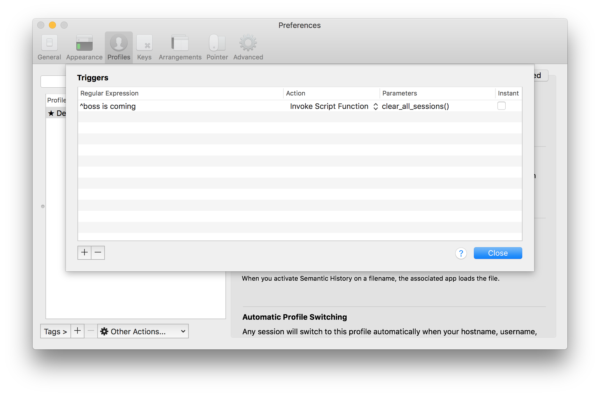

RPCs
====

iTerm2 offers a very powerful facility where a script (typically a daemon)
registers a function as available to be invoked by iTerm2.

For example, suppose you want to bind a keystroke to clear all history in all
sessions.

This script shows a working example:

.. code-block:: python

    #!/usr/bin/env python3

    import asyncio
    import iterm2
    import sys
    import time

    async def main(connection, argv):
	app = await iterm2.async_get_app(connection)

	async def clear_all_sessions():
            code = b'\x1b' + b']1337;ClearScrollback' + b'\x07'
	    for window in app.terminal_windows:
		for tab in window.tabs:
		    for session in tab.sessions:
			await session.async_inject(code)

	await app.async_register_rpc_handler("clear_all_sessions", clear_all_sessions)

	await connection.async_dispatch_until_future(asyncio.Future())

    if __name__ == "__main__":
	iterm2.Connection().run(main, sys.argv)

A lot of this should look familiar from the :doc:`daemon` example. Let's focus
on the parts we haven't seen before.

This call registers the RPC:

.. code-block:: python

	await app.async_register_rpc_handler("clear_all_sessions", clear_all_sessions)

The first argument gives the name of the RPC. To keep it simple, this example
uses the same name as the function. The name you register with is the name you
use when invoking the function. The passed-in function, `clear_all_sessions`,
will be called by iTerm2 at a later time. Note that it is `async`. The
registered function *must* be `async`.

.. code-block:: python

	async def clear_all_sessions():

This is the definition of the registered function.

.. code-block:: python

            code = b'\x1b' + b']1337;ClearScrollback' + b'\x07'

This is an iTerm2 `proprietary escape code <https://www.iterm2.com/documentation-escape-codes.html>`_ that clears the screen and erases history.

.. code-block:: python

    for window in app.terminal_windows:
	for tab in window.tabs:
	    for session in tab.sessions:
		await session.async_inject(code)

This iterates over every session and injects the ClearScrollback code.
Injecting a byte array makes the session appear to receive that byte array
as input, as though it had been output by the running app in the terminal.
Injection is safe to use even while receiving input because it uses its own
parser (so there's no interaction between a half-received escape sequence in
the true input and the injected byte array).

Invocation
----------

To invoke an RPC, create a key binding for it. Go to **Preferences > Keys** and
click the + button. Select **Invoke Script Function** as the action and enter a
function call in the field beneath it. Like this:

Then press the associated keystroke and the function will be invoked.

You can also bind a trigger to invoke a function automatically:

REPL
----

To test RPCs in the REPL, you need to give the iterm2 library a chance to read
the request from the connection to iTerm2. The simplest way is to tell it to
watch for requests for a set period of time, like this:

.. code-block:: python

    await app.connection.async_dispatch_for_duration(1)

The argument of `1` is how long to wait. Requests to execute registered
functions wait in a queue until they can be handled. That means you can press a
key in iTerm2 to call the RPC and then do `async_dispatch_for_duration(0.1)` and
it will be handled immediately.

Arguments
---------

Registered RPCs may take arguments. Any argument may take a value of
of `None`, so take care to handle that possibility.

Here's an example of a call with arguments:

.. code-block:: python

    function_name(session: session.id, favorite_number: 123, nickname: "Joe")

The name of the function and the name of each argument is an *Identifier*.
Identifiers begin with a letter and may contain letters, numbers, and
underscore. Every character must be ASCII.

Each argument must have a distinct name.

The value passed to an argument can take one of three types:

1. A *path*, like `session.id`.

Paths refer to variables. Variables are attached to a session. Some are defined
by iTerm2 (like `session.id`) and others, beginning with `user.` are defined by
the user.

For a full list of the iTerm2-defined paths, see `Badges <https://www.iterm2.com/documentation-badges.html>`_.

To set a user-defined variable, you can use an escape sequence or call
:meth:`iterm2.Session.async_set_variable`. Variables can be strings or numbers.

A reference to an unset variable raises an error, preventing the function call
from being made. If you modify the path to end with `?` that signals it is
optional. Optional variables, when unset, are passed as `None` to the Python
function.

If a terminal session does not have keyboard focus then no `session.` variables
will be available.

2. A number, like `123`.

Numbers are integers or floating point numbers. They can be negative, and you
can use scientific notation.

3. A string, like `"Joe"`.

Strings are escaped like JSON, using backslash.

Timeouts
--------

By default, iTerm2 stops waiting for a function's result after five seconds.
The function continues to run until completion. You can pass an optional
`timeout` parameter to `app.async_register_rpc_handler` to set your own timeout
value in seconds.

Composition
-----------

Functions may be composed. A registered function can return a value which the
becomes an argument to a subsequent function call. Here's a snippet of an
example, which you can add to the `main` function of the previous example:

.. code-block:: python

    async def add(a, b):
        return a + b

    async def times(a, b):
        return a * b

    async def show(s):
        session = app.current_terminal_window.current_tab.current_session
        await session.async_inject(bytes(str(s), encoding="utf-8"))

    await app.async_register_rpc_handler("times", times)
    await app.async_register_rpc_handler("add", add)
    await app.async_register_rpc_handler("show", show)

To compute 1+2*3 and inject it into the current session, use this invocation:

.. code-block:: python

    show(s: add(a: 1, b: times(a: 2, b: 3)))

Note that if there are invocations that have no dependencies, they may run
concurrently. There is no guarantee on the order of invocations except that an
RPC will not be made until all its dependencies have completed without errors.

Errors are propagated up the call chain and shown in an alert with a traceback.

Continue to the next section, :doc:`hooks`.

----

--------------
Other Sections
--------------

* :doc:`/index`
    * :doc:`index`
    * :doc:`example`
    * :doc:`running`
    * :doc:`daemons`
    * RPCs
    * :doc:`hooks`

Indices and tables
==================

* :ref:`genindex`
* :ref:`search`
